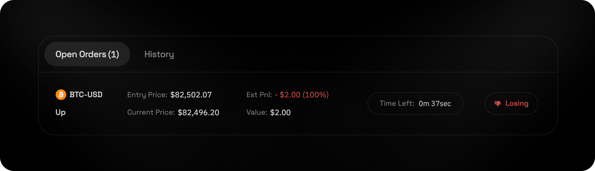
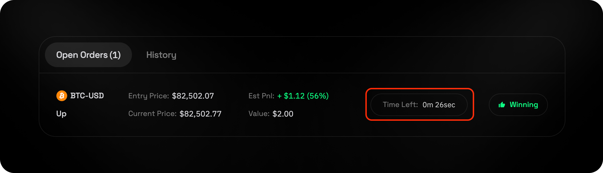
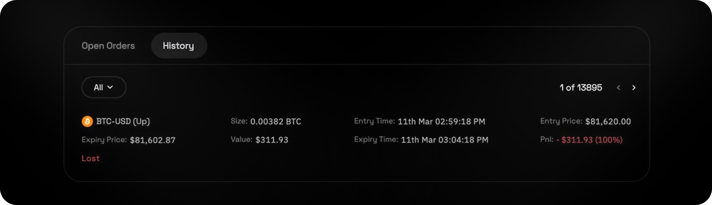

## Contents
* [Overview](#overview)
* [How to Place Trades](#how-to-place-trades)
* [Viewing an Open Order](#viewing-an-open-order)
* [Closing an Order](#closing-an-order)
* [Viewing Past Trades](#viewing-past-trades)

## Overview

<video
  autoPlay
  muted
  loop
  playsInline
  className="w-full aspect-video"
  src="https://logx-docs-public.s3.us-east-1.amazonaws.com/Options.mp4"
></video>

Binary options on LogX Network offer a **simple yet powerful way to trade price movements**, providing traders with **fixed payouts** based on whether an asset's price **ends up above or below a set level** at expiry. With **on-chain transparency, instant settlements, and gasless execution**, LogX binary options allow for **quick decision-making and strategic trading** in a dynamic DeFi environment.

## How to Place Trades

* Open the App
* Select the Options Market
* Enter Trade Amount
* Set Duration
* Review Trade Summary
   * Profit - Amount earned if your prediction is correct.
   * Loss - Amount lost if your prediction is incorrect.
   * Fees - Trading costs associated with the order.
* Go Up or Down
   * **Up** – You profit if the price increases.
   * **Down** – You profit if the price decreases.

## Viewing an Open Order

You can view Options Orders underneath the chart on the trading page.

## Closing an Order

Your order will automatically close at the end of the selected duration, and your profit or loss will be settled in your account.

## Viewing Past Trades

The history tab provides a clear view of your past trades that helps to track performance and analyse past decisions.