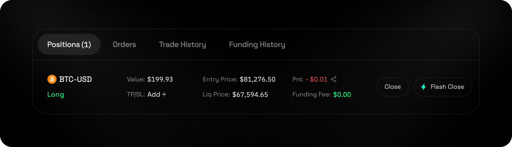
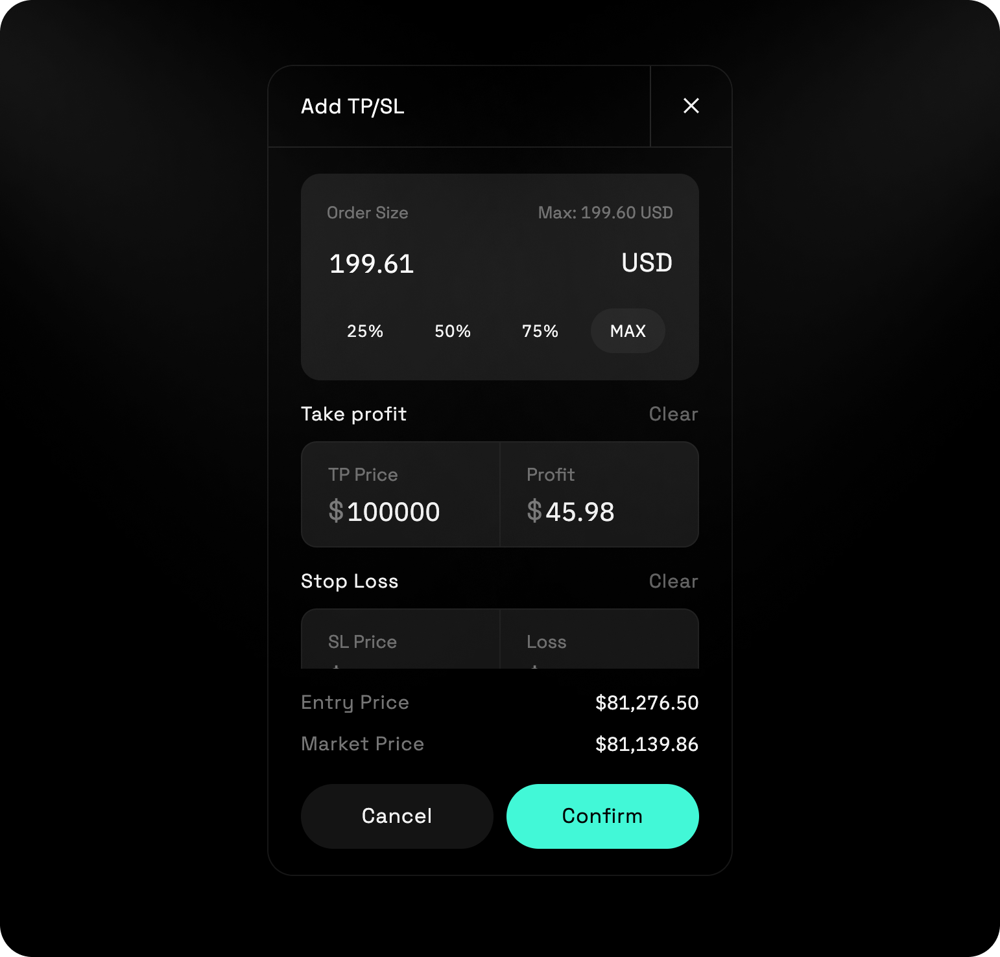
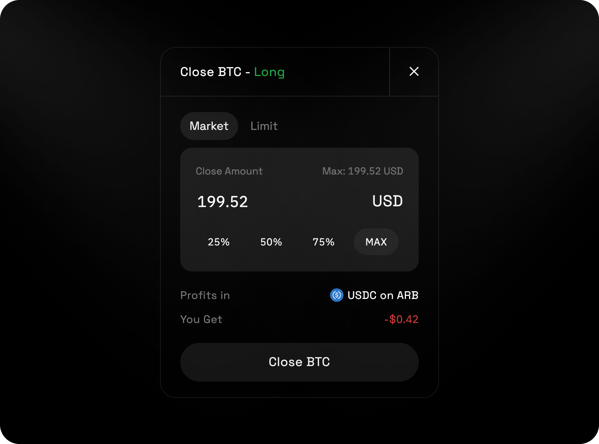

## Contents
* [Overview](#overview)
* [How to Place Trades](#how-to-place-trades)
* [Managing Position](#managing-position)
* [Setting TP / SL](#setting-tp--sl)
* [Closing Position](#closing-position)
* [Viewing Trade History](#viewing-trade-history)

## Overview

Perpetual futures on LogX Network provide traders with **leveraged exposure to asset price movements**—all on-chain for **maximum transparency, security, and efficiency**. Unlike traditional futures, these contracts **have no expiration date**, allowing traders to hold positions indefinitely while continuously settling profits and losses. With **high leverage, real-time price adjustments, and seamless execution**, LogX perpetual futures offer a **flexible and powerful tool** for hedging, speculation, and strategic trading in a dynamic DeFi environment.

<video
  autoPlay
  muted
  loop
  playsInline
  className="w-full aspect-video"
  src="https://logx-docs-public.s3.us-east-1.amazonaws.com/perp.mp4"
></video>

## How to Place Trades

* Open the App
* Select a Perp Market
* Choose an Order Type:
* Choose an Order Type:
   * Market Order - Executes instantly at the current price.
   * Limit Orders - Executes when the price reaches your set level.
* Enter Trade Amount
* Set Leverage
* Review Trade Summary
   * Size - Calculated as `Amount × Leverage`. PnL and fees are based on this.
   * Liq Price - The price at which your position will be liquidated.
   * Slippage - Potential price impact due to market conditions.
   * Fees - Trading costs associated with the order.
* Go Long or Short
   * **Long** – You profit if the price increases.
   * **Short** – You profit if the price decreases.

## Managing Position

 

You can view Perp Positions underneath the chart on the trading page.

## Setting TP / SL

You can add TP/SL via the Positions tab.
* Go to the perp position on a positions table.
* Under the TP / SL column click on the ➕ Add button.
* A pop-up will open.
* Enter you take profit / stop loss price levels
* Check estimated gain or loss %.
* Press confirm

## Closing Position

You can close via the Positions tab.
* Go to the position on the positions table.
* Click on the [**Close**] button to the right.
* A pop-up will open.
* Select the amount you wish to close.
* Click [**Close Position**].

## Viewing Trade History

You can monitor all your completed perpetual trades under the **History** tab. This lets you stay on top of your strategies, see PnL and rewards, and refine future trading strategies.