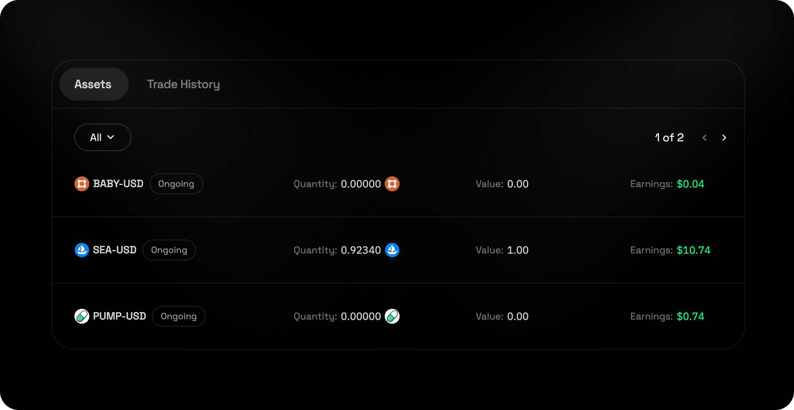
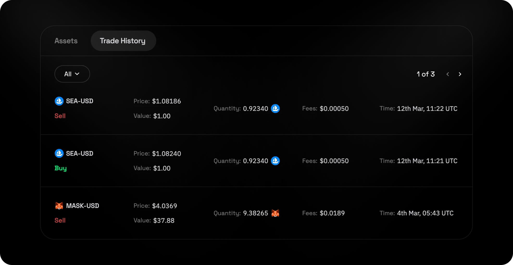

## Contents
- [Overview](#overview)
- [How to Place Trades](#how-to-place-trades)
- [Managing Holdings](#managing-holdings)
- [Viewing Trade History](#viewing-trade-history)

## Overview

Pre-market trading on LogX Network allows users to **trade tokens before they are officially listed** on exchanges, providing **early access to price discovery and strategic positioning**. These markets empower traders to **capitalize on early opportunities**.

<video
  autoPlay
  muted
  loop
  playsInline
  className="w-full aspect-video"
  src="https://logx-docs-public.s3.us-east-1.amazonaws.com/videos/Pre+Markets.mp4"
></video>

## How to Place Trades

1. Open the App
2. Select a Pre-Market Trading Pair
3. **Choose Buy or Sell:**
   - **Buy** – Go long on the token, expecting the price to increase.
   - **Sell** – Go short on the token, expecting the price to decrease.
4. Enter Trade Amount
5. **Review Trade Summary:**
   - **Available Balance** – Check your available funds.
   - **Estimated Size** – The total value of your trade.
   - **Max Slippage** – Possible price impact based on market depth.
   - **Fees** – Trading costs associated with the order.
6. Confirm Trade

## Managing Holdings

 

You can view your open pre-market holdings under the **Assets** tab, tracking price movements and market trends in real time.

## Viewing Trade History

 

You can track completed pre-market trades under the Trade history tab, allowing you to review past moves and refine future strategies.

## Disclaimer

<Alert type="warning">
  These pre-markets are **free and 100% driven by pure speculation.** They are **not** endorsed, affiliated, or backed by any official project teams. Prices, liquidity, and market dynamics are entirely community-driven—**just raw trading action.** Enter at your own risk, ape responsibly. 🫡
</Alert>