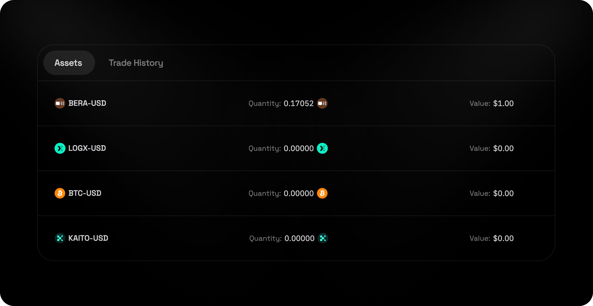
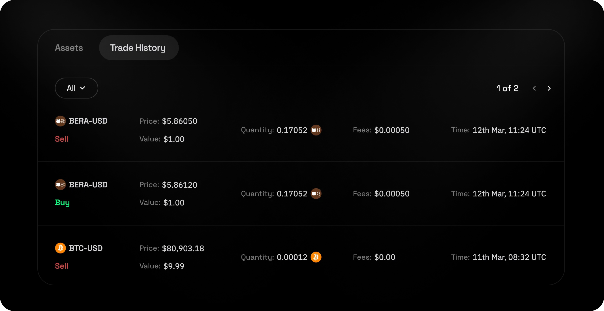

## Contents
- [Overview](#overview)
- [How to Place Trades](#how-to-place-trades)
- [Manage Holdings](#manage-holdings)
- [Viewing Trade History](#viewing-trade-history)

## Overview

Spot markets on LogX Network allow users to **buy and sell tokens instantly at real-time market prices** with **on-chain transparency, security, and efficiency**. Unlike derivatives, **spot trading involves direct ownership of assets**, making it ideal for long-term holding or active trading.

**Many pre-market tokens transition to spot markets** once they officially launch at TGE, providing a seamless trading experience for early investors.

<video
  autoPlay
  muted
  loop
  playsInline
  className="w-full aspect-video"
  src='https://logx-docs-public.s3.us-east-1.amazonaws.com/IntroducingSpotMarkets.mp4'
></video>

## How to Place Trades

1. **Open the App**
2. **Select a Spot Market Trading Pair**
3. **Choose Buy or Sell:**
   - **Buy** – Acquire the token for long-term holding or trading.
   - **Sell** – Exit or take profits by selling your tokens.
4. **Enter Trade Amount**
5. **Review Trade Summary:**
   - **Available Balance** – Check your available funds.
   - **Estimated Size** – The total value of your trade.
   - **Max Slippage** – Possible price impact based on market depth.
   - **Fees** – Trading costs associated with the order.
6. **Confirm Trade**

## Manage Holdings

 

You can view your **spot market holdings** under the **Assets** tab, tracking real-time balances and market price movements.

## Viewing Trade History

 

You can track completed spot trades under the Trade history tab, helping you monitor past activity and optimise future trades.