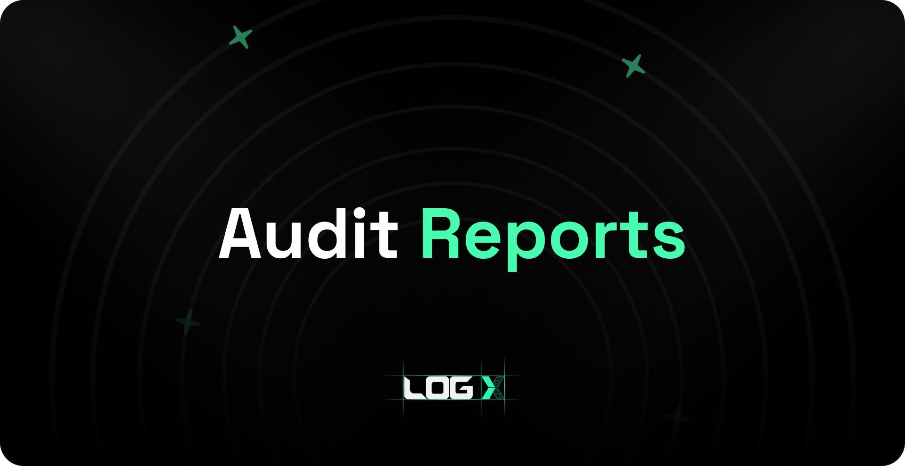

 

## Security and Audits

To uphold the highest security standards for our trading and token contracts, we partnered with multiple parties like Credshield and Salus. Both of these are trusted and highly respected blockchain auditing firms, with which we collaborate to get our auditing of smart contracts done. This audit is designed to identify potential vulnerabilities, ensuring that our token operates smoothly and securely within the decentralized ecosystem.

### Token Audit Details:

-   **Auditor**: Credshield
-   **Audit Date**: 13/08/2024
-   **Audit report**: [Download the report here](https://logx-docs-public.s3.amazonaws.com/LogX_Token_Final_Report.pdf)

### Trading Audit Details:

-   **Auditor**: Salus
-   **Audit Date**: 07/08/2024
-   **Audit report**: [Download the report here](https://logx-docs-public.s3.amazonaws.com/LogX_trading_audit_report_2024-09-07.pdf)
