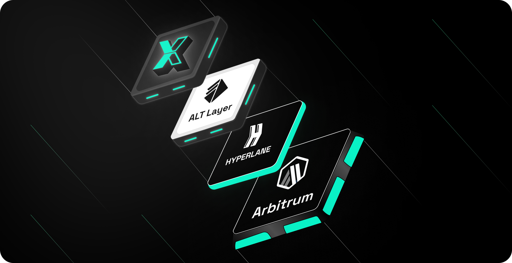
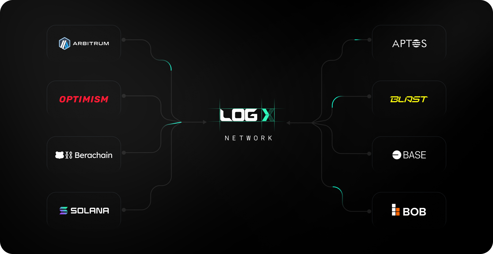

## **Abstract**

LogX Network is designed to be the **ultimate DeFi SuperApp**, bringing together **all major DeFi products** into a unified, high-performance ecosystem. Our goal is to **offer a seamless, CEX-like experience** while maintaining the transparency and self-custody benefits of DeFi.

Built for **speed, efficiency, and scalability**, LogX **outperforms centralized exchanges (CEXs)** in execution, security, and usability. By bridging **liquidity across both EVM and non-EVM chains**, including **Solana and Berachain**, LogX eliminates fragmentation, ensuring a **frictionless trading experience**.

## **Acknowledging the Pioneers**

We recognise and appreciate the groundbreaking work done by other decentralized exchanges that have paved the way for LogX Network. Platforms like GMX, Hyperliquid, AEVO, and Vertex have not only influenced our development but have also served as inspiration. 

## **The Need for LogX Network**

The crypto market currently **trades over $3 trillion per month**, with **99% of this volume locked in centralized exchanges (CEXs)**. While DeFi was created to offer transparency and self-custody, on-chain derivatives trading has failed to gain mass adoption due to:

- **Lack of High-Performance On-Chain Trading Infrastructure**
- **Liquidity Fragmentation Across Networks** (especially newer ones)
- **High Gas Fees & Execution Latency**
- **Tedious Wallet Signing & Poor User Experience**
- **No Seamless Consumer-Grade Apps**

Currently, only **1-2% of all crypto futures trading happens on-chain** because existing solutions simply **don't match CEX efficiency**. **LogX Network changes this.**

## **LogX Network's Edge**

LogX Network stands as a powerhouse in infrastructure, offering:

- **Over 30,000 TPS**
- **100ms Trade Latency**
- **Deep liquidity from Binance, Coinbase, and Bybit**
- **Tight spreads & minimal slippage for optimal execution**
- **Cross-chain compatibility across EVM & non-EVM networks**
- **CEX-like Gasless and one-click trading experience**
- **Ability to support multiple asset types: Not just derivatives**

The network leverages best-in-class infrastructure, including:

- **Arbitrum Orbit Stack:** Providing a robust and scalable foundation.
- **Eigen DA:** Ensuring reliable and secure data access.
- **Hyperlane Network:** Facilitating seamless communication across multiple networks.
- **Alt Layer:** Enhancing the overall network architecture.

 

We have designed a novel trading engine that assigns each token its own "Buying Power" rather than considering tokens at face value for matching orders and margins. This approach allows LogX Network to onboard tokens from any new chain, regardless of associated risks. This unique capability enables LogX Network to scale across new ecosystems, such as BTC L2s, faster than any other perpetual DEX.

 

## **The Ultimate DeFi SuperApp**

LogX Network is more than just a trading platform—it's an **all-in-one DeFi SuperApp**, bringing together **every major DeFi product under one roof** with a **seamless, gasless, and high-performance experience**. Whether it's **perpetuals, spot trading, options, or meme coin launchpads**, LogX has it all. And this is **just the beginning—what we have in roadmap so far is only 10% of what's coming.**

- **Perpetuals Trading** – **100+ Perp Pairs, Including Exotic Pre-Markets**
    - Trade gaslessly with instant order matching, just like a CEX.
    - Access exotic pre-market pairs **not available anywhere else**.
    
- **Leveraged Prediction Markets** – **20x Leverage on On-Chain Predictions**
    - The **first-ever** leveraged prediction markets in DeFi.
    - Bet on political events, sports outcomes, and more—with **high leverage**.
    
- **Options Trading** – **Exotic & Binary Options for Advanced Strategies**
    - Bringing **structured derivatives on-chain** with user-friendly execution.
    - Making complex financial products **accessible to everyone**.
    
- **Pre Markets** – **Trade New Assets Before Anyone Else**
    - Access **early-stage projects and exotic assets** before they hit major markets.
    - Get a **first-mover advantage** in speculative trading.
    
- **Spot Trading** – **Optimized for Speed & Liquidity**
    - Seamless, **low-latency spot trading** with deep liquidity.
    - Trade a **wide range of cryptocurrencies** with minimal slippage.
    
- **Real-World Assets (RWAs)** – **On-Chain Real Estate & Beyond**
    - **Fractional ownership of real estate** and real-world assets.
    - Bringing **traditional finance into DeFi** with transparent and accessible trading.

- **Meme Coin Launchpad** – **Gasless Creation & Trading**
    - **Launch and trade meme coins effortlessly**, with no gas fees.
    - A **one-stop hub** for the most viral trends in crypto.

- **Treasury Yield** – **One-Click Access to Treasury Bill Yields**
    - Earn stable, **low-risk yields** from **treasury bills—on-chain**.
    - Maximizing stablecoin utility within the LogX ecosystem.
    
- **Gaming** – **Play & Earn Within LogX**
    - Integrated games that **reward players with real value**.
    - Turning **idle time into earning opportunities**.
    

### **And This is Just the Beginning…**

LogX isn't stopping here. **We're building the next evolution of DeFi**, where **every financial product you can imagine** will be accessible **in one place**, with **institutional-grade liquidity from Binance, Coinbase, and Bybit**. What you see now is just **10% of what's coming**—we're **expanding faster than ever** to make LogX the **ultimate DeFi hub**. 🚀