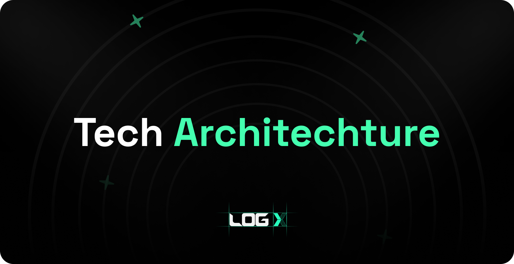

## **Chain Agnostic Trading**

One of the major challenges in DeFi is liquidity fragmentation. Users often find their funds scattered across various networks in multiple token formats, necessitating fund transfers to execute trades on specific networks. LogX Network aims to address this issue.

With LogX Network, you can deposit funds from any supported blockchain network and use them to trade directly on the LogX Network. For instance, if you have $100 on Arbitrum and *$*50 on Optimism, you can seamlessly place a trade worth $150 on LogX Network. We consolidate funds from all networks for a wallet, enabling truly chain-agnostic trading experience.

## **Account Abstraction Based capabilities**

We have integrated Account Abstraction (AA) into the core stack of LogX Network, enhancing our platform with several seamless efficiencies:

- **Smart Accounts**: Every user on LogX Network opens a smart contract wallet-based account. This acts as a margin account, allowing users to deposit funds from any supported network seamlessly within seconds.
- **Gasless Trading Experience**: One of the key motivations for the development of Layer 2 networks was to reduce base layer gas fees. Although modern Layer 2 networks generally have lower gas fees, costs can vary between networks and spike during periods of congestion, adding to the total cost of initiating trades and hindering user onboarding. By integrating AA and creating smart contract wallets, we sponsor the gas fees, providing a Centralized Exchange (CEX)-like, gas less trading experience.
- **Session Keys:** The integration of Account Abstraction masks the complexities of underlying blockchain processes. We leverage session keys to open and close trades, this enhancement allows users to place trades without the need to approve or sign transactions, streamlining the trading experience.

## **Token Agnostic Margin and Settlement**

To enhance user experience, we have introduced the innovative concept of **Buying Power** on the LogX Network. Rather than evaluating tokens at their nominal value for matching orders and margins, each wallet (margin account) possesses its own "Buying Power". This allows users to use any token in their Smart Wallet as collateral to open trades and settle margins. Furthermore, buying power enables us to match orders independently of the user's available collateral. For instance, if a user has **`100 USDC`** and **`0.1 ETH`** in their Smart Wallet, considering $4000 as price of ETH, the total buying power would be approximately **`$400`**. Consequently the user can place trades up to a **`$400`** margin. User's PNL is settled in quote token; positive balances will be transferred to the use's Smart Wallet from Log's vault. This approach revolutionises how trades are executed across networks on derivatives exchanges.

## **Seamless Smart Wallet Experience**

When a user deposits tokens into the LogX Network, a Smart Wallet is automatically created on the user's behalf. This Smart Wallet also serves as the margin account, which is used to settle the user's P&L after closing trades. In most DEXes, users must deposit their funds into the DEX's margin account to trade, where they lose custody, thus centralizing the user flow. By using Smart Wallets, LogX addresses this limitation and provides the most secure margin accounts for users. Additionally, Smart Wallets tightly integrate the chain with the trading exchange, opening up new avenues for innovation on the blockchain where each address can function as a margin account.

## **Truly Omni-chain Defi Super App**

LogX Network will utilise Hyperlane's warp routes to seamlessly transfer tokens into and out of the chain. Users will deposit the tokens they wish to use as collateral into Hyperlane's contract on their chosen chain. Once the tokens are deposited on the source chain and the validator announces it on the chain, the relayer relays the message, and synthetic assets are minted on the destination chain in a decentralised manner. This process makes bridging—or depositing—to the chain as fast as, if not faster than, depositing funds into any DEX's margin account. Additionally, this efficiency enables us to launch the LogX Network on a new network in less than two days. This represents one of the most advanced scaling infrastructures built for derivatives trading.

## **Architecture to support any Asset Type**

LogX Network currently supports trading of perpetuals, spots, options and pre-market, that to its architecture design we were able to scale to broad range of assets very quickly. Very soon yield products, RWAs will also be live on LogX network.

## **Capital Efficiency**

On the LogX Network, orders from all networks converge at a single venue, ensuring low trading costs and exceptionally fast order matching. This aggregation of orders eliminates the need for abundant liquidity across multiple sources, thereby optimising capital use and enhancing trading efficiency. This streamlined approach not only reduces overhead but also simplifies the trading process for users.

## **Exotic Trading Markets**

Traders constantly seek a diverse array of markets. Thanks to our innovative order matching system and liquidity model, we are able to support an extensive variety of exotic trading markets, including memecoins, pre-market token pairs more as quickly as possible.

## **Innovative Order Book Matching System**

To build something as groundbreaking as the LogX Network, traditional models for DEXs simply won't suffice. Currently, order books and AMMs are the most common methods used by DEXs. We are utilising an advanced system known as intent-based order book matching. The concept here involves collaborating with multiple market makers to continuously stream price quotations and fetch the best prices for each asset type. This method proves far more efficient in securing the best and most cost-effective means to fulfil trades.

## **Simple, Easy-to-Use Interface**

One of the reasons centralised exchanges (CEXs) succeed is due to their extremely simple and easy-to-use trading experience. After serving over 160,000 traders and consulting with more than 10,000 of them, we have designed a trading terminal that is as intuitive as possible. We've stripped away all complexities from the trading interface, creating a streamlined user experience that just works—free from clunky charts or unnecessary fees that impede a trader's experience.

## **Abundant Liquidity**

We are collaborating with multiple market makers, all of whom are providing liquidity to the base LogX Network. All trades placed on different networks are collated on the LogX Network, ensuring ample liquidity to execute trades in less than a second at any time for any asset.

## **Mobile-Friendly**

While most DEX infrastructures cater only to a small fraction of traders, our goal is to build systems for the masses, with mobile accessibility playing a crucial role. We've developed an interface that not only supports web based trading but is also optimized for a mobile-friendly experience.

## **Composability**

The LogX Network infrastructure has been developed with blockchain principles at its core. It allows anyone to use the LogX Network to deploy their trading interface on the network of their choice. This flexibility enables DEXes to offer their own interfaces and unique capabilities, enhancing the overall trading experience.

## **`$LOGX` Integration**

The LogX Network has been purposefully built around the protocol's native `$LOGX` token, which serves as the official gas token of the network. The network is also designed to incorporate multiple utilities for $LOGX within the system, enhancing functionality and user engagement.

## **Ability to power multiple applications**

The LogX Network infrastructure is scalable far beyond derivatives trading. This robust platform can also power a diverse array of consumer applications, including spot trading, memecoin launchpads, leveraged prediction markets, real-world assets (RWAs), GameFi, SocialFi applications, and more!